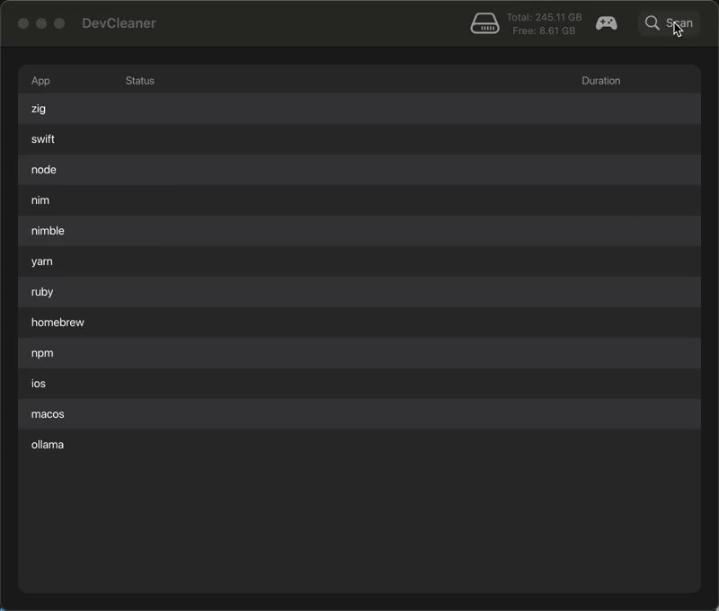

# DevCleaner

A fast, lightweight development project cleaner for macOS, rewritten in Nim.



## Features

- **15+ Development Tools Supported** - Automatically finds and cleans cache from:
  - **Languages**: Rust, Go, Zig, Swift, Nim, Python, Ruby, Haskell, Elixir, Deno
  - **Build Tools**: Gradle, Maven, CMake, Cargo, Bundler, Bazel
  - **Package Managers**: npm, yarn, pnpm, pip, Composer
  - **Frameworks**: Flutter, Node.js, Unity
  - **IDEs**: VS Code, 8 JetBrains IDEs (IntelliJ, PyCharm, WebStorm, GoLand, PhpStorm, Rider, CLion, RubyMine)
  - **System**: Xcode, iOS DeviceSupport, Android SDK, Docker, Homebrew
  - **Version Managers**: nvm, pyenv, choosenim
  - **AI/ML**: Hugging Face, PyTorch, Ollama

- **Safe Cleaning** - All items moved to macOS Trash (not permanently deleted)
- **Smart Detection** - Automatically finds projects by marker files (package.json, Cargo.toml, etc.)
- **Last Accessed** - Shows when each project was last opened
- **Modern UI** - Built with [GLFW](https://www.glfw.org/) and [NanoVG](https://github.com/memononen/nanovg) for smooth, native performance
- **Configurable** - All cleaning rules defined in a single [scfg](https://github.com/heuer/scfg-nim) config file

## Installation

### Prerequisites

- macOS 11.0+
- [Nim](https://nim-lang.org/) 2.0.0+

### Build from Source

```bash
# Clone the repository
git clone https://github.com/yourusername/DevCleaner.git
cd DevCleaner

# Install dependencies
nimble install

# Build release version
nimble build -d:release

# Run
./devcleaner
```

## Usage

1. Launch the application
2. Click **Scan** to analyze cache directories
3. Review found items, their sizes, and last accessed time
4. Click individual trash icons or **Clean All** to move caches to Trash
5. Empty Trash in Finder when ready

## Configuration

Cleaning rules are defined in `config/builtin.scfg`. Example:

```scfg
project node {
    bin npm
    search {
        type recursive
        base "~"
        markers package.json
        target node_modules
        skip_dirs ~/Applications ~/Desktop ~/Movies ~/Music ~/Pictures ~/Public
        skip_hidden true
    }
}

project rust {
    bin cargo
    search {
        type recursive
        base "~"
        markers Cargo.toml
        target target
        skip_dirs ~/Applications ~/Desktop ~/Movies ~/Music ~/Pictures ~/Public
        skip_hidden true
    }
}
```

## Project Structure

```
DevCleaner/
├── config/
│   └── builtin.scfg          # Cleaning rules configuration (15+ tools)
├── marketing/                # Marketing materials
│   ├── product_copy.md       # Product description for Gumroad
│   ├── privacy_policy.md     # Privacy policy
│   └── user_guide.md         # User documentation
├── src/
│   ├── devcleaner/           # Source modules
│   │   ├── app_state.nim     # Application state management
│   │   ├── config_parser.nim # scfg configuration parser
│   │   ├── constants.nim     # App constants
│   │   ├── disk_info.nim     # Disk space information
│   │   ├── filesize.nim      # File size formatting
│   │   ├── fonts.nim         # Font management
│   │   ├── getattrlistbulk.nim # macOS bulk file metadata
│   │   ├── glfw_nanovg.nim   # GLFW/NanoVG wrapper
│   │   ├── icons.nim         # UI icons
│   │   ├── macos_utils.nim   # macOS-specific utilities
│   │   ├── native_toolbar.nim # Native macOS toolbar
│   │   ├── path_env.nim      # PATH environment handling
│   │   ├── readme_summarizer.nim # Project description extraction
│   │   ├── rendering.nim     # Rendering utilities
│   │   ├── scanner.nim       # Cache scanning logic
│   │   ├── task.nim          # Async task management
│   │   ├── theme.nim         # UI theme
│   │   ├── types.nim         # Type definitions
│   │   ├── ui.nim            # Main UI implementation
│   │   ├── ui_constants.nim  # UI constants
│   │   ├── ui_utils.nim      # UI utilities
│   │   ├── ui_widgets.nim    # UI widgets
│   │   ├── user_prefs.nim    # User preferences
│   │   └── utils.nim         # Utility functions
│   └── devcleaner.nim        # Main entry point
├── notes/                    # Development notes
└── devcleaner.nimble         # Package manifest
```

## Support This Project

DevCleaner Community is free and open source. If you find it useful and want to support continued development, you can purchase the paid version which includes additional features and priority support:

https://bradleynash.gumroad.com/l/devcleaner

## License

MIT License - See LICENSE file for details
